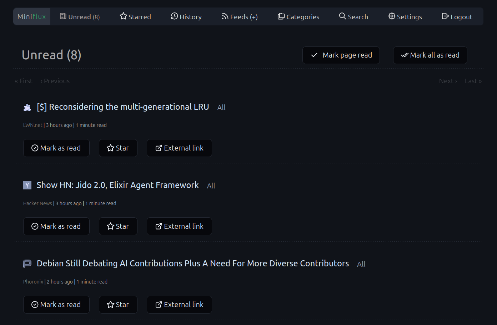

# Miniflux More Bonito

A "more bonito" ;-) modded version of the Miniflux Bonito theme.

## About
This is a custom CSS theme for [Miniflux](https://miniflux.app/). It builds upon the original "Full Nord Overhaul" to deliver an even more refined and tweaked reading experience. 

## Installation
1. Open your Miniflux instance and navigate to **Settings**.
2. Scroll down to the **Custom CSS** field.
3. Copy the contents of the CSS file from this repository and paste it into the box.
4. Click **Update** to apply the theme.

## Credits
* **Modded Version:** Version 0.9 by [nodefive](https://github.com/nodefive/miniflux-more-bonito)
* **Original Theme:** [Miniflux Bonito](https://github.com/rghedin/minifluxbonito) (Version 1.2 - Full Nord Overhaul - Unified Final) by rghedin
